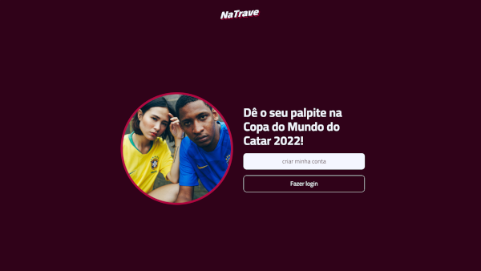

TABELA DE CONTEÚDOS

* [Sobre](#Sobre)
* [Imagens](#Imagens)
* [LinkdoSite](#LinkdoSite)
* [Tecnologias](#Tecnologias)

# Sobre

O projeto NaTrave foi desenvolvido em parceria com a codar.me, onde tem como objetivo registrar os palpites dos usuários para a copa do mundo de 2022!

<h3 align="center">🚧👷‍♂️Em Construção🚧👷‍♂️</3>

# Imagens

# LinkdoSite

https://na-trave-web-vert.vercel.app

# Tecnologias

- [JavaScript](https://www.javascript.com)
- [ReactJS](https://pt-br.reactjs.org)
- [tailwind](https://tailwindcss.com)

- [NodeJS](https://nodejs.org/en/)

